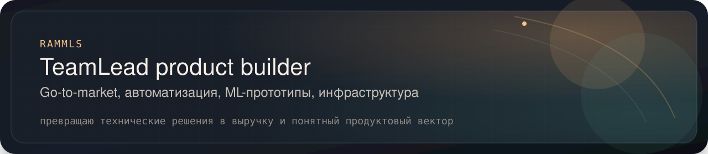
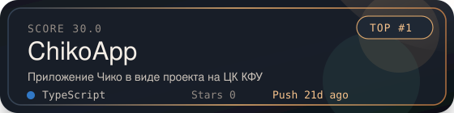
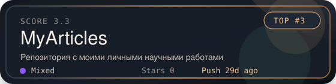
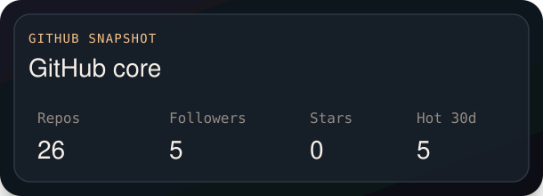
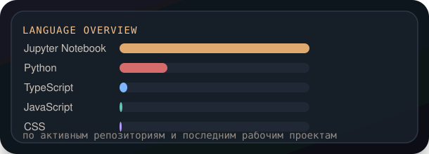
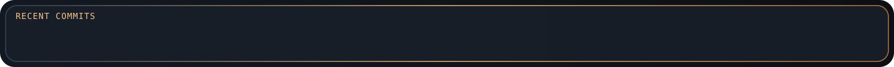

  

<h1 align="center">RAMMLS</h1>

  Веду команды и продуктовые направления, где важно не только сделать, но и нормально продать решение: automation, developer tooling, ML-прототипы и инфраструктурные сервисы. 
  Сейчас основной фокус — <b>self-host платформа для автоматической проверки лабораторных работ</b> с внятным UX, нормальной эксплуатацией и понятной ценностью для пользователей.

  
  
  

  
  
  
  
  

---

## Stack

<table align="center">
  <tr>
    <td align="center" valign="top" width="33%">
      
        
      
        
      
    </td>
    <td align="center" valign="top" width="33%">
      
        
      
        
      &nbsp;
    </td>
    <td align="center" valign="top" width="33%">
      
        
      
        
      &nbsp;
    </td>
  </tr>
</table>

---

## Pin Gallery

  В галерее только активные проекты. `hotness-score` считает свежесть последнего push за последний месяц и добавляет бонус за `stars`, `forks` и открытые `issues`, поэтому наверху оказываются именно те репозитории, над которыми я реально работаю сейчас.

<!-- PIN-CARDS:START -->
<table align="center">
  <tr>
    <td align="center">
      
    </td>
  </tr>
  <tr>
    <td align="center">
      
    </td>
  </tr>
</table>
<!-- PIN-CARDS:END -->

---

## GitHub Snapshot

  
  

---

## Contribution Snake

  

---

## Recent Activity

  

